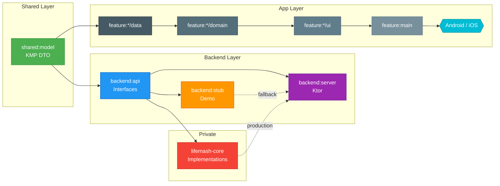
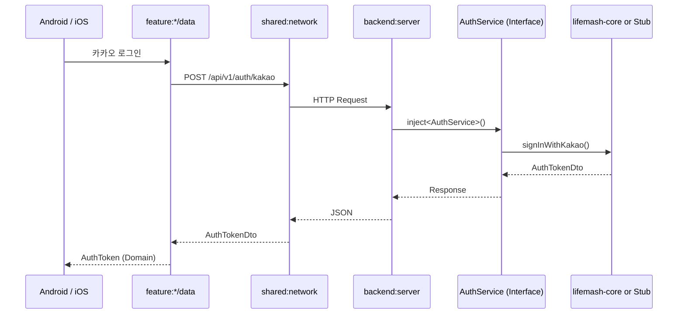
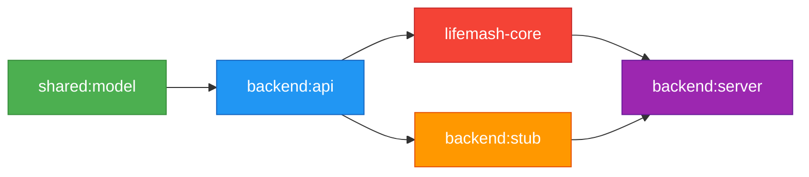

# LifeMash

KMP(Kotlin Multiplatform) 기반 모바일 앱 + Ktor 백엔드를 하나의 모노레포로 관리하는 프로젝트입니다.

## Architecture

### Module Structure



### Request Flow



### Dependency Direction



## Modules

| Module | Type | Description |
|--------|------|-------------|
| `shared:model` | KMP | 앱 ↔ 백엔드 공통 DTO |
| `shared:network` | KMP | Ktor HttpClient (OkHttp / Darwin) |
| `shared:designsystem` | KMP | Material3 디자인 토큰, 공통 Composable |
| `backend:api` | JVM | 서비스/레포지토리/클라이언트 인터페이스 |
| `backend:stub` | JVM | 인터페이스 데모 구현체 (공개 빌드용) |
| `backend:server` | JVM | Ktor Routes, Plugins, Koin DI |
| `feature:auth` | KMP | 카카오/구글 소셜 로그인 |
| `feature:calendar` | KMP | 캘린더 이벤트/그룹/댓글 |
| `feature:assistant` | KMP | AI 어시스턴트 (Claude API) |
| `feature:home` | KMP | 홈 블록 + 마켓플레이스 |
| `feature:notification` | KMP | 키워드 알림 + FCM |

## Tech Stack

- **Kotlin Multiplatform** — Android + iOS 단일 코드베이스
- **Compose Multiplatform** — 선언적 UI
- **Ktor** — 클라이언트 (앱) + 서버 (백엔드)
- **Exposed** — Kotlin SQL ORM
- **Koin** — 멀티플랫폼 DI
- **PostgreSQL** — Neon (Serverless)
- **Firebase** — Analytics, Crashlytics, FCM
- **GitHub Packages** — 모듈 간 아티팩트 배포

## Build

```bash
# 전체 백엔드 빌드
./gradlew :backend:server:build

# Android 앱 빌드
./gradlew :app:assembleDebug

# 백엔드 로컬 실행
./gradlew :backend:server:run
```

## License

[MIT](LICENSE)
