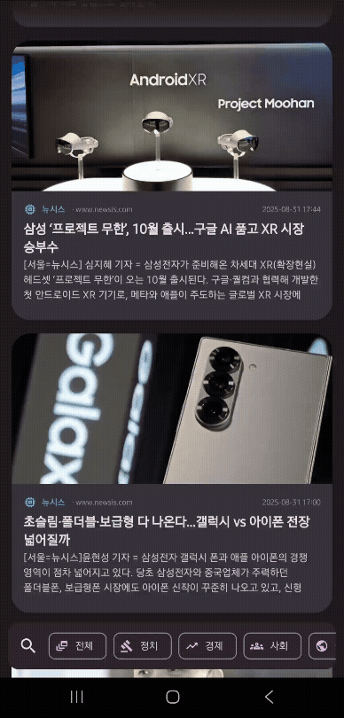

# 🚀 LifeMash News App

다양한 언론사의 뉴스를 모아보고, 관심 있는 기사를 스크랩할 수 있는 뉴스 앱입니다.

 

## 📱 스크린샷 & 주요 기능

|                              홈 (피드)                               | 검색 | 스크랩 |
|:-----------------------------------------------------------------:|:---:|:---:|
|  | | |

*   **뉴스 피드**: 주요 언론사의 최신 뉴스를 받아볼 수 있습니다.
*   **기사 검색**: 키워드를 통해 원하는 뉴스를 빠르게 검색할 수 있습니다.
*   **스크랩**: 나중에 다시 보고 싶은 기사를 저장하고 관리할 수 있습니다.
*   **웹뷰**: 앱 내에서 편안하게 기사 원문을 확인할 수 있습니다.

 

## 🏛️ 기술 스택 및 아키텍처

이 프로젝트는 **Android Clean Architecture**와 **Domain-Driven Design (DDD)** 원칙을 기반으로 한 **Multi-Module** 구조로 설계되었습니다.

*   **Architecture**:
    *   MVVM (Model-View-ViewModel)
    *   Clean Architecture & Domain-Driven Design (DDD)
    *   Dependency Injection (Hilt)
*   **UI**:
    *   Jetpack Compose & Material Design 3
    *   Coroutines & Flow for Asynchronous tasks
*   **Libraries**:
    *   Retrofit2 & OkHttp3 for Networking
    *   Room for Local Database
*   **Static Analysis**:
    *   Detekt
*   **CI/CD**:
    *   GitHub Actions

 

## 📂 모듈 구조

프로젝트는 각 계층과 기능에 따라 여러 모듈로 분리되어 코드의 재사용성을 높이고, 빌드 시간을 단축하며, 유지보수를 용이하게 합니다.

### 아키텍처 컨셉 (Clean Architecture)

아래 다이어그램은 이 프로젝트가 따르는 클린 아키텍처의 기본 구조를 보여줍니다. 의존성 규칙에 따라 외부 계층(UI)이 내부 계층(Domain)에 의존하며, Domain 계층은 다른 어떤 계층에도 의존하지 않습니다.

*   **UI Layer (`:feature:xyz`)**: 화면(UI)과 ViewModel을 담당합니다. 사용자의 입력을 받아 `Domain` 계층의 UseCase를 호출하고, 그 결과를 UI 모델로 변환하여 화면에 표시합니다.
*   **Domain Layer (`:domain:feature-xyz`)**: 순수한 비즈니스 로직을 포함합니다. UseCase, Domain Model, Repository 인터페이스로 구성되며, Android 프레임워크에 대한 의존성이 없습니다.
*   **Data Layer (`:data:xyz`)**: `Domain` 계층의 Repository 인터페이스를 구현합니다. 데이터를 가져오는 역할을 담당합니다.

### 전체 모듈 의존성

아래는 현재 프로젝트의 모든 모듈 간의 상세 의존성 그래프입니다.

*   **`app`**: 모든 모듈을 통합하고 최종 Android 애플리케이션을 빌드하는 메인 모듈입니다.
*   **`feature`**: 각 화면(UI)과 ViewModel을 담당하는 모듈입니다.
*   **`domain`**: 순수한 Kotlin으로 작성된 비즈니스 로직(UseCase, Entity)을 포함합니다. Android 프레임워크에 대한 의존성이 없습니다.
*   **`data`**: `domain` 계층의 Repository 인터페이스를 구현하며, 네트워크(API) 또는 로컬 데이터베이스(Room) 등 데이터 소스를 관리합니다.
*   **`core`**: 여러 모듈에서 공통으로 사용되는 `Design System`, `Network` 모듈, 데이터 모델 등을 포함합니다.
*   **`build-logic`**: Gradle Convention Plugin을 사용하여 모듈별 의존성 관리를 중앙화합니다.

 

## 🚀 시작하기

### APK 다운로드

`google-services.json` 파일이 없어 직접 빌드에 어려움이 있을 수 있습니다. CI를 통해 빌드된 최신 APK 파일을 아래 링크에서 다운로드하여 앱을 바로 설치하고 테스트해볼 수 있습니다.

*   **[➡️ 최신 APK 다운로드 (GitHub Releases)](https://github.com/your-username/LifeMash-NewsApp/releases)**

 

## 📄 라이선스

이 프로젝트는 [LICENSE](LICENSE) 파일에 명시된 MIT 라이선스 정책을 따릅니다.
