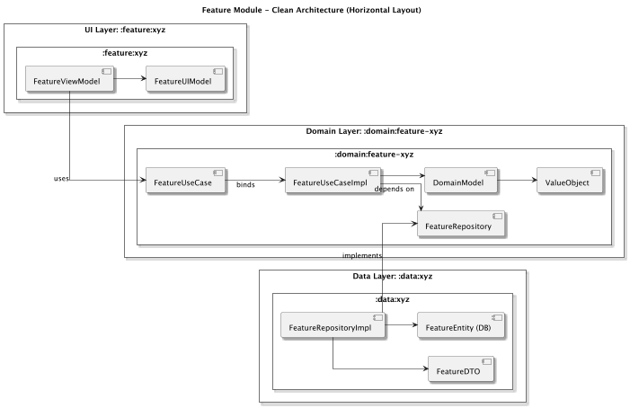
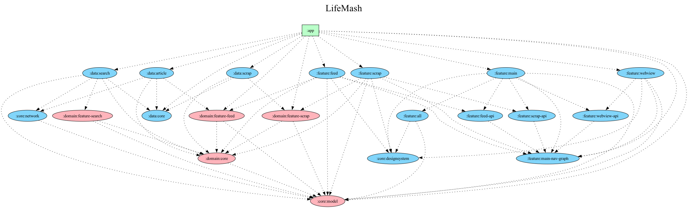

# LifeMash

캘린더 기반 소셜 앱. 친구·가족과 일정을 공유하고, 피드로 서로의 순간을 확인합니다.

 

## 주요 기능

*   **소셜 캘린더**: 그룹(커플, 가족, 친구)과 일정을 공유하고 댓글로 소통
*   **피드**: 친구들의 일정과 순간을 카드 피드로 확인
*   **탐색**: 사용자와 이벤트를 검색하고 팔로우
*   **프로필**: 순간 사진, 공개 캘린더, 팔로워/팔로잉
*   **AI 어시스턴트**: 자연어로 일정 관리 및 브리핑

 

## 기술 스택 및 아키텍처

**Android Clean Architecture**와 **Domain-Driven Design (DDD)** 원칙을 기반으로 한 **Multi-Module** 구조.

*   **Architecture**:
    *   MVVM (Model-View-ViewModel)
    *   Clean Architecture & Domain-Driven Design (DDD)
    *   Dependency Injection (Hilt)
*   **UI**:
    *   Jetpack Compose & Material Design 3
    *   Coroutines & Flow for Asynchronous tasks
*   **Libraries**:
    *   Retrofit2 & OkHttp3 for Networking
    *   Room for Local Database
*   **Static Analysis**:
    *   Detekt
*   **CI/CD**:
    *   GitHub Actions

 

## 모듈 구조

### 아키텍처 컨셉 (Clean Architecture)

의존성 규칙에 따라 외부 계층(UI)이 내부 계층(Domain)에 의존하며, Domain 계층은 다른 어떤 계층에도 의존하지 않습니다.

*   **UI Layer (`:feature:xyz`)**: 화면(UI)과 ViewModel을 담당합니다.
*   **Domain Layer (`:domain:feature-xyz`)**: 순수한 비즈니스 로직을 포함합니다.
*   **Data Layer (`:data:xyz`)**: Repository 인터페이스를 구현합니다.

### 전체 모듈 의존성

*   **`app`**: 모든 모듈을 통합하고 최종 Android 애플리케이션을 빌드하는 메인 모듈
*   **`feature`**: 각 화면(UI)과 ViewModel
*   **`domain`**: 순수 Kotlin 비즈니스 로직 (UseCase, Entity)
*   **`data`**: Repository 구현, 네트워크/로컬 데이터 소스
*   **`core`**: Design System, Network 모듈, 공통 모델
*   **`build-logic`**: Gradle Convention Plugin

 

## 문서

- [코딩 컨벤션](.docs/convention.md) — 아키텍처 철학과 코딩 패턴
- [상태 설계 원칙](.docs/state-design-principles.md) — UiState 타입 설계 원칙
- [Rich UiState](.docs/rich-uistate.md) — UiState를 빈약한 데이터 홀더에서 Rich Model로
 

## 시작하기

### APK 다운로드

최신 APK는 [GitHub Releases](https://github.com/your-username/LifeMash-App/releases)에서 다운로드할 수 있습니다.

 

## 라이선스

이 프로젝트는 [LICENSE](LICENSE) 파일에 명시된 MIT 라이선스 정책을 따릅니다.
